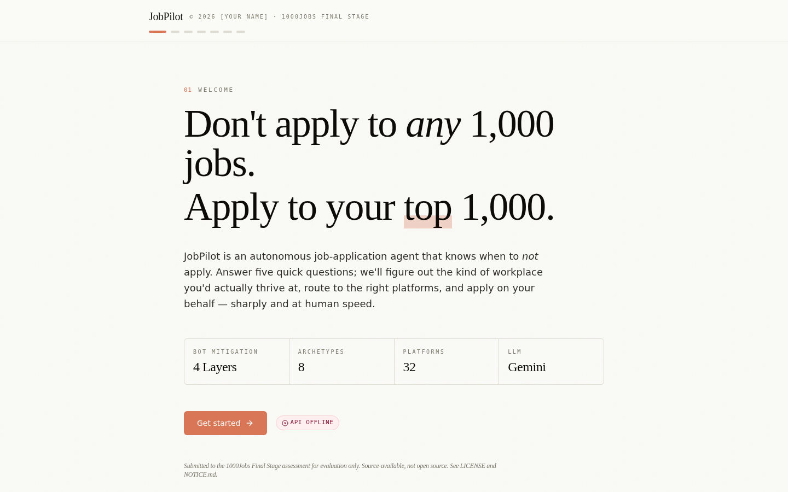
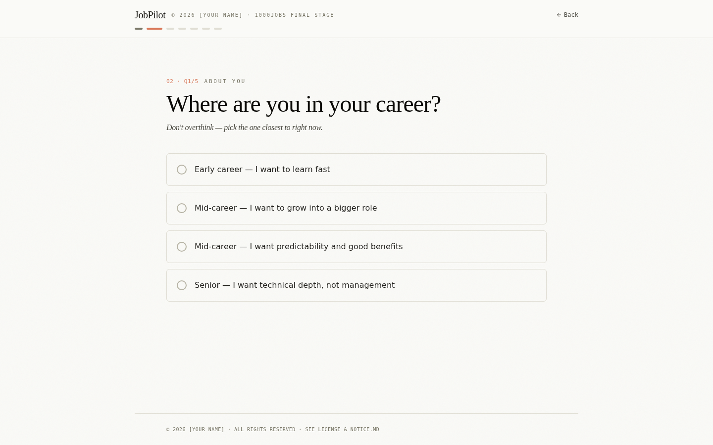
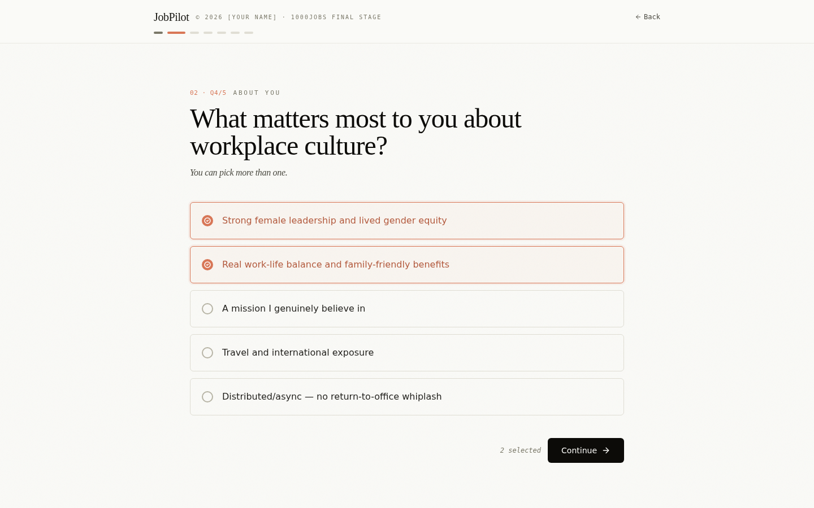
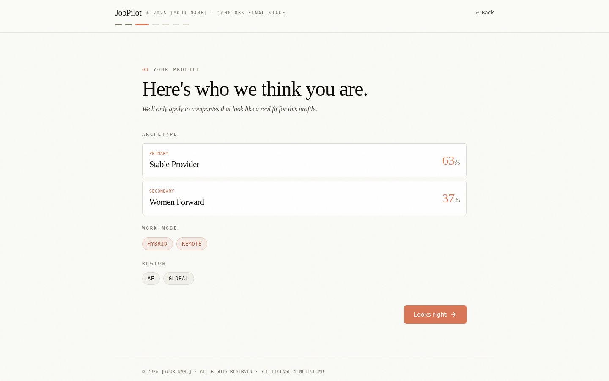

# JobPilot — The Stealth Agent

**An autonomous job application agent with archetype-based fit intelligence and multi-platform routing.**

> Original work by **Areej Ahmed** · submitted to the **1000Jobs Final Stage assessment** for evaluation only.
> © 2026 Areej Ahmed. All rights reserved. Source-available, **not** open source.
> See [LICENSE](LICENSE).



The frontend is a guided product funnel:

| Step | What happens |
|---|---|
| 1. Welcome | "Don't apply to *any* 1,000 jobs. Apply to your top 1,000." |
| 2. Onboarding (Q&A) | Five quick questions about career stage, company size, work mode, culture priorities, and region |
| 3. Your profile | The system reveals the inferred archetype (e.g. *Stable Provider* primary, *Women-Forward* secondary) |
| 4. Your details | Name, email, resume PDF path, resume text |
| 5. Choose jobs | Pick from the brief's sample list, or paste custom Greenhouse URLs |
| 6. Final check | Toggle headless / live, toggle auto-submit / review |
| 7. Results | Per-job table + downloadable tracker xlsx + email .eml preview |





---

## What this is

JobPilot is a working autonomous job-application system, end-to-end:

- **The Stealth Agent.** Drives a real Greenhouse application, fills standard fields, uploads a resume PDF, answers open-ended screening questions with an LLM grounded in the candidate's actual experience, and submits autonomously. Wrapped in a local FastAPI server.
- **Fit Intelligence.** Scores a job against the candidate's archetype profile *before* applying. The system refuses to apply where the candidate wouldn't actually thrive — measured on signals like women-in-leadership, parental leave, work-life balance, and travel expectations.
- **Multi-platform routing.** A 32-platform graph maps work mode (onsite / hybrid / remote / freelance) and region (UAE / global / etc.) to the appropriate set of platforms. v1 ships full Greenhouse support; 31 other platforms are mapped with structured stubs and clear roadmap.
- **Application Tracker (xlsx).** A working Excel workbook with Dashboard, Tracker, Interview Rounds, Story Bank (STAR + R), Status Legend, and Platforms reference sheets. 68 live formulas, drop-down validation, conditional formatting.
- **Editorial-grade web frontend.** React + Vite + Tailwind. Custom design language. Walk-through UI from archetype picker to apply.

---

## Read this first

If you have ten minutes:

1. **[REPORT.md](REPORT.md)** — the research, reasoning, and decisions behind every part of this submission. *Read this if nothing else.*
2. **[docs/jobpilot_stealth_agent_design.docx](docs/jobpilot_stealth_agent_design.docx)** — the full 22-section technical design.
3. **[docs/jobpilot_tracker.xlsx](docs/jobpilot_tracker.xlsx)** — the application tracker, ready to use.

If you have two minutes: just look at the screenshots in `docs/`.

---

## The thesis in one sentence

> Volume-only autonomous application is a louder version of a funnel that is already failing. The product wins by being the first system that knows *when not to apply*, applies only where the candidate would actually want to work, and produces sharper open-ended answers than a tired human writes at 11pm on a Tuesday.

The full reasoning is in [REPORT.md](REPORT.md).

---

## Architecture

```
┌─────────────────┐         ┌──────────────────────┐
│   Frontend UI   │ ◀──────▶│   FastAPI server     │
│  (Vite/React)   │  HTTP   │   port :8000         │
└─────────────────┘         └──────────┬───────────┘
                                       │
            ┌──────────────────────────┼──────────────────────────┐
            ▼                          ▼                          ▼
    ┌──────────────┐         ┌─────────────────┐          ┌─────────────────┐
    │ POST /apply  │         │ POST /score     │          │ POST /platforms │
    │ (Router)     │         │ (Fit Intel)     │          │ (Work-mode →    │
    └──────┬───────┘         └────────┬────────┘          │  platform list) │
           ▼                          ▼                   └─────────────────┘
   Detect platform           Scrapers + LLM +
   → Adapter (live)          Archetype scoring
   or StubAdapter
```

Module map (under `src/jobpilot/`):

| Module | Responsibility |
|---|---|
| `api/` | FastAPI server, Pydantic schemas |
| `browser/` | Patchright stealth launcher (with `playwright-stealth` fallback) |
| `flow/` | Greenhouse-specific orchestration |
| `flow/adapters/` | Per-platform adapters + registry + StubAdapter |
| `flow/router.py` | URL → platform → adapter dispatch |
| `humanizer/` | Log-normal typing, Bezier mouse paths, idle pauses |
| `llm/` | Provider-agnostic LLM client and prompt templates |
| `fit/` | Eight archetypes, feature extraction, scoring, scrapers |
| `platforms/` | The 32-platform graph with work-mode and region filtering |
| `observability/` | structlog setup, screenshots, DOM snapshots |

---

## Quick start (under 10 minutes)

### Prerequisites

- Python 3.11+
pip install python3 

- [Poetry](https://python-poetry.org/)
pip install poetry 

- A Gemini API key
# Get one at: https://aistudio.google.com/apikey

### Install

```bash
git clone https://github.com/aa2149/jobpilot.git
cd jobpilot

pip install poetry 
poetry install
poetry update package
poetry run patchright install chromium

cp .env.example .env
# Open .env, paste your GEMINI_API_KEY 

poetry run uvicorn jobpilot.api.server:app --reload --port 8000
```

In a second terminal, the frontend:

```bash
cd frontend
npm install
npm run dev
# open http://localhost:3000
```

### Run an end-to-end application

```bash
# Update sample_payload.json with your real resume path and resume text, then:
curl -X POST http://localhost:8000/apply \
  -H "Content-Type: application/json" \
  -d @sample_payload.json
```

By default the agent **submits autonomously** (per the brief). Set `auto_submit: false` in your payload (or `AUTO_SUBMIT=false` in `.env`) to halt before submit for review.

Set `HEADLESS=false` to **watch the agent work** — Chromium opens and the form fills in real time at human speed.

---

## API reference

### `POST /apply`

Drive an application end-to-end via the right platform adapter.

**Sample request:** see [`sample_payload.json`](sample_payload.json).

**Success response (200):**
```json
{
  "status": "success",
  "run_id": "run_2026-05-01T09-12-44Z_8f3a",
  "state": "submitted",
  "fields_filled": 14,
  "questions_answered": 3,
  "resume_uploaded": true,
  "duration_ms": 32118,
  "screenshot": "logs/run_.../post_submit.png",
  "logs_path":  "logs/run_.../run.jsonl"
}
```

**Error states** — every failure maps to one of:

| `state` | Meaning | HTTP |
|---|---|---|
| `submitted` | Form submitted (default behavior). | 200 |
| `pre_submit_ready` | Form filled, halted (only with `auto_submit=false`). | 200 |
| `below_fit_threshold` | Pre-flight score gate refused. | 200 |
| `invalid_payload` | Required applicant fields missing. | 400 |
| `job_not_found` | URL did not resolve to an application form. | 404 |
| `platform_unrecognized` | URL not detected as any supported platform. | 404 |
| `platform_not_implemented` | Platform detected, adapter not yet implemented. | 422 |
| `form_schema_unrecognized` | Form structure outside known patterns. | 422 |
| `blocked_by_bot_detection` | Cloudflare / hCaptcha / interstitial. | 503 |
| `llm_error` | LLM call failed. | 502 |
| `upload_failed` | Resume rejected. | 500 |
| `timeout` | Step exceeded budget. | 504 |

### `POST /score`

Score a job against the candidate's archetypes.

```json
{
  "job_url": "https://job-boards.greenhouse.io/grammarly/jobs/7767680",
  "candidate_archetypes": [
    { "name": "women_forward", "weight": 0.6 },
    { "name": "stable_provider", "weight": 0.4 }
  ]
}
```

Returns `fit_score` ∈ [0, 1], a per-archetype breakdown for the company, a verdict (`apply` / `uncertain` / `skip`), and a reasoning paragraph with concrete evidence.

### `POST /platforms`

Discover platforms for a given work-mode + region preference set.

```json
{
  "work_modes": ["remote", "freelance"],
  "regions": ["AE", "global"]
}
```

Returns the matching platforms grouped by kind (ATS / aggregator / remote-first / regional / recruiter / freelance) with `live` / `stub` / `planned` status.

### `GET /archetypes` and `GET /health`

Self-explanatory. Used by the frontend.

---

## The eight archetypes

| Archetype | Who picks it |
|---|---|
| The Founder Track | Fresh grads, aspiring founders, builders who want range and pace. |
| The Corporate Climber | Mid-career, ambition for title and scope. |
| The Stable Provider | Mid-career, family-focused. Predictability over upside. |
| The Women-Forward Workplace | Cultures with female leadership and lived equity. |
| The Globe-Trotter | People who want travel as part of the job. |
| The Mission Believer | The work itself must matter. |
| The Deep Specialist | Senior ICs who want technical depth and respect. |
| The Remote-First Lifer | Async-friendly, distributed, no RTO whiplash. |

Full feature definitions in `src/jobpilot/fit/archetypes.py`. The taxonomy is original to this submission.

---

## Bot mitigation: four-layer model

| Layer | What's checked | Our countermeasure |
|---|---|---|
| Protocol | CDP `Runtime.enable` timing, automation flags | Patchright (protocol-level patches) |
| Fingerprint | `navigator.webdriver`, canvas, WebGL, fonts, audio | Patchright + UA matching + viewport randomization |
| Behavioral | Typing rhythm, mouse paths, scroll, idle | Custom humanizer module |
| Network/IP | IP reputation, geo/timezone consistency | Optional residential proxy hook |

What we do **not** do: solve CAPTCHAs, bypass explicit anti-bot consent boxes, log into accounts on the user's behalf. Halt and surface instead.

---

## Logging & observability

Every run produces `logs/<run_id>/`:

- `run.jsonl` — structured log, one JSON object per line
- `post_submit.png` (or `pre_submit.png` in review mode) — full-page screenshot
- `failure.png` — captured automatically on any non-success state
- `dom_snapshot.html` — saved when state is `form_schema_unrecognized`

---

## Testing

```bash
poetry run pytest                       # all tests
poetry run pytest tests/unit            # 20 tests, fast
```

20 unit tests pass: 6 archetype-scoring tests, 2 humanizer-distribution tests, 12 platform-graph and routing tests.

---

## Configuration reference (`.env`)

| Variable | Default | Notes |
|---|---|---|
| `ANTHROPIC_API_KEY` | — | Required if `LLM_PROVIDER=anthropic` |
| `OPENAI_API_KEY` | — | Required if `LLM_PROVIDER=openai` |
| `LLM_PROVIDER` | `anthropic` | `anthropic` \| `openai` \| `ollama` |
| `LLM_MODEL` | `claude-sonnet-4-5` | Provider-specific model id |
| `HEADLESS` | `true` | Set to `false` to watch live |
| `AUTO_SUBMIT` | `true` | The agent submits autonomously by default |
| `STEALTH_PROFILE` | `patchright` | `patchright` \| `playwright_stealth` |
| `PROXY_URL` | — | Optional residential proxy |
| `LOG_LEVEL` | `info` | `debug` \| `info` \| `warning` \| `error` |
| `FIT_CACHE_REVIEWS_DAYS` | `30` | Glassdoor cache TTL |
| `FIT_CACHE_CAREERS_DAYS` | `7` | Careers-page cache TTL |

---

## License & IP

This is **source-available, not open source**. The work is licensed under a custom **Evaluation & Personal-Use License** (see [LICENSE](LICENSE)).

In short:

- The Assessors (Allan, Ziad, and 1000Jobs) may **read, run, and evaluate** this submission.
- Anyone may **personally use** it for their own job search.
- **Commercial use, derivative works, or incorporation into any product** requires written permission.
- The eight-archetype taxonomy, the work-mode routing, the prompt templates, the design language, and all other elements listed in [NOTICE.md](NOTICE.md) are reserved.

If you want to discuss licensing, contact areejahmedicty8@gmail.com.

---

## Acknowledgments

This work takes deliberate inspiration from **[career-ops by Santiago Fernandez](https://github.com/santifer/career-ops)**, a brilliant open-source job-search system. We adopted Santiago's "filter, don't spray" thesis and his STAR + R format for the Story Bank. Everything else — the archetype taxonomy, multi-platform routing, UAE focus, web frontend, tracker workbook — is original work. 

---

*Made with intention · Dubai · 2026*
